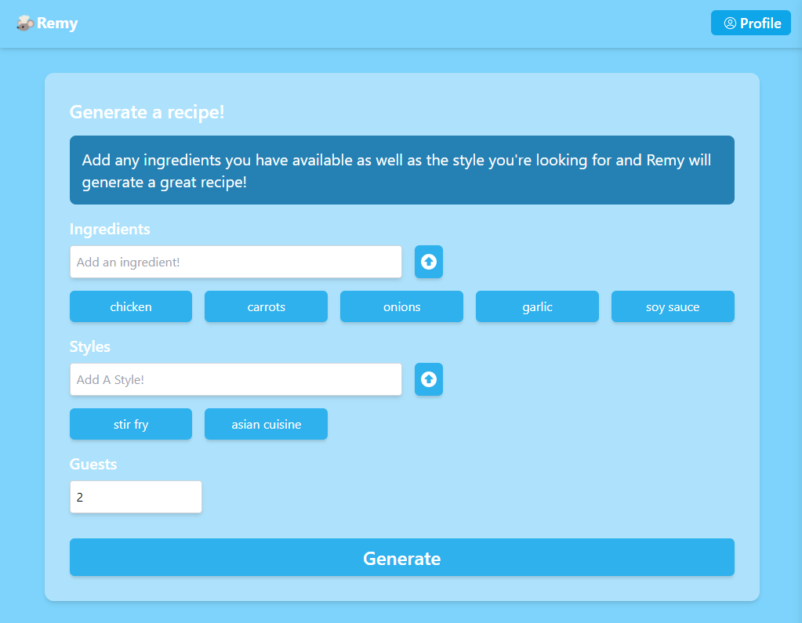

# Remy: Anyone Can Be A Chef!


Stop wasting food and money! Enter the ingredients you have into **Remy**, and let the app craft delicious recipes based on what’s available. Your personal AI-powered chef is ready to help, without the need for a little mouse under a hat (though that would be cool).

## Overview
Remy is an AI-powered recipe generator that helps you turn what you already have into culinary magic. Built with Next.js and styled with Tailwind CSS, the app leverages OpenAI's GPT-3.5 Turbo model to generate personalized recipes. All interactions with the GPT model are handled server-side, following OpenAI's best practices for security and performance.

<!-- You can check out a working version of my app [here](https://google.com) -->

## Running the client locally
If you would like to run this app locally, feel free to clone the repo and then navigate into the root directory of this project. Then, run the development server:

```bash
npm install
# then run
npm run dev
```
## User Features

### User Profile


To personalize your cooking experience, Remy requires a user profile. Simply sign up with a username and password—quick and easy!


### Recipe Form

The heart of Remy is the Recipe Form. Enter the ingredients you have on hand, and let the magic happen! For example, I was going for an Asian-inspired chicken stir-fry in this instance. Once your ingredients are in, hit the **Generate** button to see what Remy cooks up!

### The Recipe

Remy sends your input to OpenAI for lightning-fast analysis, and voilà—your recipe is ready! This one was spot-on for my stir-fry craving. Now my partner and I can enjoy a delicious dinner without extra trips to the grocery store.

### Remy Community


The Remy Community is a space where users can submit and browse each other’s creations. Feeling uninspired? This is the perfect place to find new flavor ideas for your next meal!

## Technical Features
**User security**: the user must be logged in in order to access the app.

**Ease of use**: uses context to make passing info easier and making prop drilling a thing of the past.

**Responsive UI**: levergaes tailiwnd CSS to create a sleek and impressive User Interface.

**Client-sdie routing**: uses react-router-dom's rotuing to create a seamless and interactive experience.

<!-- ## Running the client  -->

created by Luis Castro.